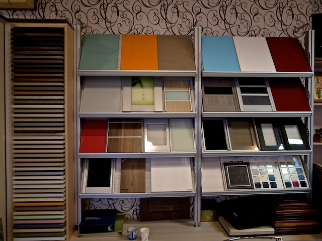



    

        
雅舍系統櫥櫃生活館位於雲林縣斗六市，成立於西元 2000 年，經營迄今已有 10 多年之久，專業服務品質受到客戶肯定。

        
雅舍的服務項目包括：系統家具、系統櫥櫃、歐式廚具，提供免費到府丈量及空間規劃服務。

        
雅舍使用的板材獲得各國多項認證，包括 E0 及 E1 等級無醛害環保板材，不僅愛地球，更為您守護全家人的健康。

        
雅舍注重所有施工細節，不僅設計能夠完全符合您的空間規劃需求，更為您挑選品質最好的五金飾件。

        
雅舍系統櫥櫃 － 為您規劃一個舒適的居家環境。

        
有任何空間規劃的需求，歡迎與我們聯絡！

    
        <ul>
            <li>聯絡人： 程文藝</li>
            <li>行動電話： 0932-517934</li>
            <li>E-mail： lux48a@yahoo.com.tw</li> 
            <li>電話： 05-5376668</li>
            <li>傳真： 05-5376368</li>
            <li>營業時間： 週一 ~ 週六  上午 9：00至晚上 9：00 （週日參觀請事先預約）</li>
            <li>門市地址： <a href="http://g.co/maps/fsm8y">雲林縣斗六市雲林路二段309號</a>（歡迎現場參觀）</li>
        </ul>
    

    

        
    

