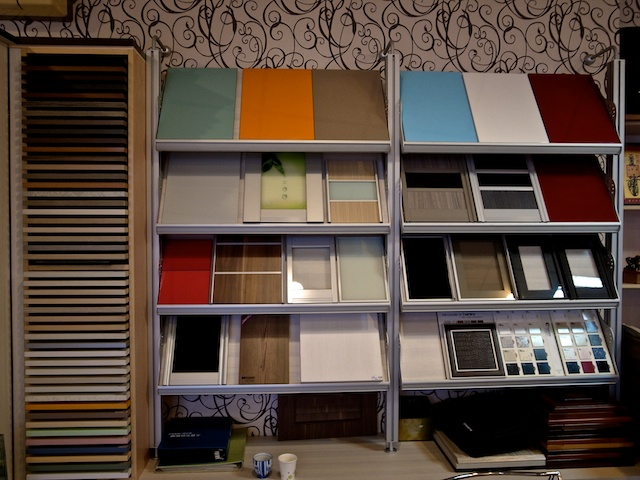



    

        
    

    

        
    

    

        
雅舍系統櫥櫃生活館位於雲林縣斗六市，成立於西元 2000 年，經營迄今已有 10 多年之久，專業服務品質受到客戶肯定。 雅舍的服務項目包括：系統家具、系統櫥櫃、歐式廚具，提供免費到府丈量及空間規劃服務。 雅舍使用的板材獲得各國多項認證，包括 E0 及 E1 等級無醛害環保板材，不僅愛地球，更為您守護全家人的健康。 雅舍注重所有施工細節，不僅設計能夠完全符合您的空間規劃需求，更為您挑選品質最好的五金飾件。

        
服務電話：0932-517934（程文藝）

    

<h2>系統家具四大優點</h2>

    

        1
        <strong>施工期短</strong>是系統家具的優點，板材在工廠預先做好半成品，再到現場組裝施工，沒有粉塵污染問題，施工噪音也降至最低。
    

    

        2
        <strong>環保健康</strong>是聰明屋主的優先考量，系統板材採用低甲醛的環保綠建材，不會危害家人的健康，並有更好的防潮、防蟲效果，適合台灣氣候。
    

    

        3
        <strong>完善收納</strong>讓居家空間更時尚簡約，依照室內空間丈量規劃的系統櫥櫃，可以將收納容量做到最佳，並兼顧外觀的時尚美感。
    

    

        4
        <strong>堅固耐用</strong>的系統家具不但可以拆除、重新組裝，更提供抗磨耐括的表面處理，有更長時間的保固與售後服務。
    

