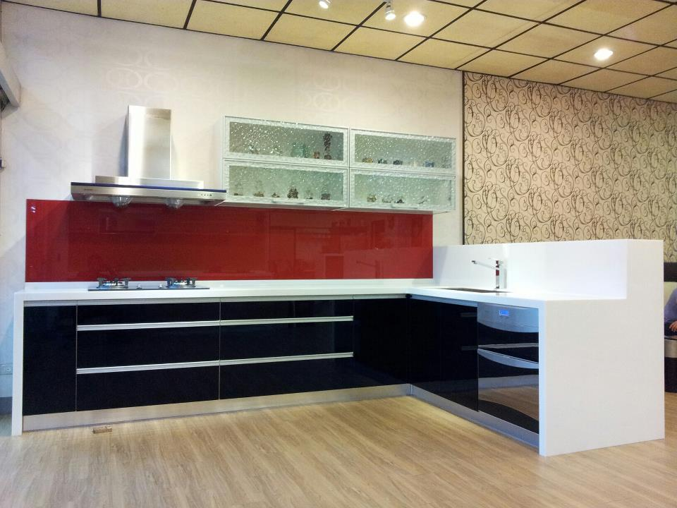



    

        
    

    

        
雅舍系統櫥櫃生活館位於雲林縣斗六市，成立於西元 2000 年，經營迄今已有 10 多年之久，專業服務品質受到客戶肯定。 雅舍的服務項目包括：系統家具、系統櫥櫃、歐式廚具，提供免費到府丈量及空間規劃服務。 雅舍使用的板材獲得各國多項認證，包括 E0 及 E1 等級無醛害環保板材，不僅愛地球，更為您守護全家人的健康。 雅舍注重所有施工細節，不僅設計能夠完全符合您的空間規劃需求，更為您挑選品質最好的五金飾件。

    

